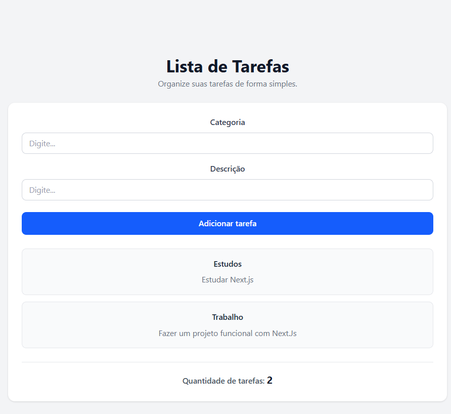

# Lista de Tarefas - Next.js

Projeto desenvolvido como exercício prático de testes unitários com Next.js, TypeScript, Jest e Testing Library.

A aplicação permite visualizar tarefas cadastradas e adicionar novas tarefas através de um formulário.

## 📸 Preview

## 🚀 Tecnologias utilizadas

* Next.js 16
* React
* TypeScript
* Jest
* Testing Library
* Jest DOM
* Tailwind CSS

## 📋 Funcionalidades

* Exibição de tarefas cadastradas.
* Adição de novas tarefas.
* Validação dos campos do formulário.
* Contagem de tarefas através de um Custom Hook.
* Testes unitários dos componentes e do Custom Hook.

## 📁 Estrutura do projeto

<pre><code>app/
├── components/
│   ├── ListaTarefa/
│   │   ├── ListaTarefa.tsx
│   │   └── ListaTarefa.test.tsx
│   │
│   ├── NovaTarefa/
│   │   ├── NovaTarefa.tsx
│   │   └── NovaTarefa.test.tsx
│   │
│   └── Tarefa/
│       └── Tarefa.tsx
│
├── data/
│   └── Tarefas.ts
│
├── hooks/
│   ├── useContadorDeTarefas.ts
│   └── useContadorDeTarefas.test.ts
│
├── types/
│   └── Tarefa.ts
│
├── page.tsx
└── page.test.tsx

├── jest.config.ts
├── package.json
└── README.md</code></pre>

## 🧩 Funcionamento

A página principal é um Server Component que busca as tarefas através da função `buscarTarefas()`.

Os dados são armazenados em um array local, simulando uma fonte de dados.

A função `buscarTarefas()` retorna uma Promise contendo a lista de tarefas cadastradas.

O componente `Tarefas` é um Client Component responsável pelo gerenciamento do estado das tarefas.

O componente `NovaTarefa` permite cadastrar uma nova tarefa informando:

* Categoria
* Descrição

Após o preenchimento dos campos, a nova tarefa é adicionada à lista.

O componente `ListaTarefa` é responsável por renderizar as tarefas cadastradas.

## 🪝 Custom Hook

O projeto possui o hook `useContadorDeTarefas`, responsável por retornar a quantidade atual de tarefas.

O hook recebe a lista de tarefas e retorna a quantidade de itens presentes no array.

O hook é testado de forma isolada utilizando `renderHook`.

## 🧪 Testes

Os testes foram desenvolvidos utilizando:

* Jest
* React Testing Library
* Jest DOM
* `render`
* `screen`
* `fireEvent`
* `renderHook`

São testados:

### NovaTarefa

* Renderização dos campos e botão.
* Preenchimento dos campos.
* Adição de uma nova tarefa.
* Validação de campos vazios.

### ListaTarefa

* Renderização correta das tarefas.

### useContadorDeTarefas

* Retorno correto da quantidade de tarefas.

### Página principal

* Renderização das tarefas carregadas pelo Server Component.

## ▶️ Como executar o projeto

### 1. Instalar as dependências

Execute no terminal:

<code>npm install</code>

### 2. Executar o projeto

Execute no terminal:

<code>npm run dev</code>

Depois, acesse no navegador:

<code>http://localhost:3000</code>

## 🧪 Executar os testes

Para executar todos os testes, utilize:

<code>npm run test</code>

O Jest irá executar os testes dos componentes, página e Custom Hook.

## 📦 Build

Para gerar a versão de produção, utilize:

<code>npm run build</code>

## 🎯 Objetivo do exercício

Este projeto foi desenvolvido para praticar:

* Criação de componentes com Next.js.
* Server Components e Client Components.
* Gerenciamento de estado com `useState`.
* Criação e utilização de Custom Hooks.
* Testes unitários.
* Testes de componentes com React Testing Library.
* Testes de Hooks com `renderHook`.
* Validação de formulários.
* Organização de um projeto Next.js com TypeScript.
